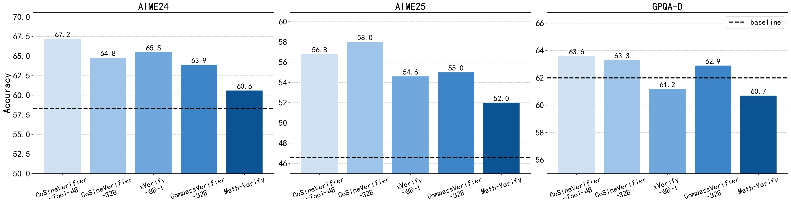

# CoSineVerifier

## 📖 Introduction
We present **CoSineVerifier-Tool**, a compact, tool-augmented verifier for **C**omputation-**O**riented **S**c**I**e**N**tific s**E**nario answer verification. It equips LLM reasoning with external tools—e.g., Python interpreter,—to accurately verify answers in **computation-oriented** scenarios such as algebraic equivalence and physical-constant alignment. We also release the **CoSineVerifier** series: efficient single-token labeling verifiers with performance comparable to CoSineVerifier-Tool. Our methods achieve state-of-the-art results on VerifyBench and SCI-VerifyBench. They also show clear improvements on RLVR tasks over other verification methods.

## ✨ Key Features

- **Tool-augmented verification for computation-oriented scientific scenarios**:

  CoSineVerifier-Tool evaluates multi-step reasoning in math and science where correctness depends on precise intermediate calculations. It also normalizes answers to a common dimension/unit for consistent numeric checks. It integrates:

  - 🧮 **Python Interpreter**: executes snippets to validate algebra/calculus steps, algorithmic logic, and data operations.
  - 🔬 **Scientific Unit Converter**: verifies and normalizes unit conversions (e.g., km/h → m/s; joule → calorie).

- **Concise, low-latency reasoning**:

- **General applicability across tasks and domains**:

    Accurately assesses equivalence across math, physics, chemistry, biology, and logical reasoning; supports short-answer and multiple-choice formats; and handles both brief answers and long-form responses.

## 🧪 Quick Start
This repository provides a **minimal working demo** for playing around the verifier conveniently.

### **⚙️ Installation**

```
pip install torch transformers pint
```

### **🚀 Run the Demo**

You can run the verifier with local or Hugging Face model checkpoint:

```
python demo.py --model /path/to/the/verifier
```

The script will:

1. Load the model and tokenizer.
2. Run several **evaluation cases** (e.g., numerical equivalence, physics derivations, symbolic math).
3. Print intermediate reasoning, any tool calls, and the final judgement for each case.

### **😊 Note**

- Use the **exact** system and user prompt templates. **Do** **not** change whitespace; preserve line breaks **identical**.
- The **final judgement** is parsed from the token `\boxed{Correct}` or `\boxed{Incorrect}` in the model’s reply.

### **🧩 Example**

Hamilton–Jacobi Projectile Motion Verification

<div style="max-height:480px; overflow:auto; border:2px solid #ccc; border-radius:8px; padding:10px; background:#fafafa; font-family:monospace; line-height:1.3; font-size:12px;">
  <hr style="border:none;border-top:1px solid #ddd;margin:6px 0"/>
  <span style="font-weight:1000;">User:</span>
  <pre style="white-space:pre-wrap; margin:6px 0; font-size:15px;">
{
  "Question":"A particle m undergoes projectile motion with an initial velocity v₀ and a horizontal angle of elevation α. Solve using the Hamilton–Jacobi equation.",
  "Ground_Truth":"['y = x tan α - (g x²) / (2 v₀² cos² α)']",
  "Model_Prediction":"y = x tan α - (g x² tan² α) / (2 v₀²) - (g x²) / (2 v₀²)"
}
  </pre>
  <hr style="border:none;border-top:1px solid #ddd;margin:6px 0"/>
  <span style="font-weight:1000;">Assistant:</span>
  <pre style="white-space:pre-wrap; margin:6px 0; font-size:15px;">&lt;tool_call&gt;
{
  "name":"python_interpreter",
  "arguments":{
    "code":"```python
      def main():
          import math
          a,g,v0,x=1.0,9.8,10.0,1.0
          y_candidate=x*math.tan(a)-(g*x**2*math.tan(a)**2)/(2*v0**2)-(g*x**2)/(2*v0**2)
          y_gold=x*math.tan(a)-(g*x**2)/(2*v0**2*(math.cos(a)**2))
          print(y_candidate,y_gold)
      if __name__=='__main__':
          main()```"
  }
}
&lt;/tool_call&gt;</pre>
  <hr style="border:none;border-top:1px solid #ddd;margin:6px 0"/>
  <span style="font-weight:1000;">User:</span>
  <pre style="white-space:pre-wrap; margin:6px 0; font-size:15px;">&lt;tool_response&gt;
{
  "name":"python_interpreter",
  "status":"Success",
  "run_result":{
    "stdout":"1.3895573024349792 1.3895573024349792",
    "stderr":"",
    "exit_success":true,
    "return_code":0,
    "status":"Finished"
  }
}
&lt;/tool_response&gt;</pre>
  <hr style="border:none;border-top:1px solid #ddd;margin:6px 0"/>
  <span style="font-weight:1000;">Assistant:</span>
  <pre style="white-space:pre-wrap; margin:6px 0; font-size:15px;">
Gold: \(y=x\tan\alpha-\frac{g x^2}{2v_0^2\cos^2\alpha}\). 
Using \(\sec^2\alpha=1+\tan^2\alpha\): \(\frac{g x^2}{2v_0^2\cos^2\alpha}=\frac{g x^2}{2v_0^2}+\frac{g x^2\tan^2\alpha}{2v_0^2}\). 
Hence \(y=x\tan\alpha-\frac{g x^2}{2v_0^2}-\frac{g x^2\tan^2\alpha}{2v_0^2}\equiv\texttt{pred}\).
Final Verdict:</b> <code>[Correct]</code>
  </pre>
</div>


### **📊Evaluation**
To reproduce the results in our paper, you can run following scripts:
- For CosineVerifier-4B-Tool
```sh
bash ./scripts/bash_general_judge_filter_batch_tools.sh 
```

- For CosineVerifier-Labeling
```sh
bash ./scripts/bash_general_judge_filter_batch.sh 
```


### **🔍 Performance**

We conduct a systematic evaluation on [VerifyBench](https://github.com/ZJU-REAL/VerifyBench) and [SCI-VerifyBench] for **CoSineVerifier-Tool-4B** and **CoSineVerifier-32B**, trained from **Qwen3-4B-Instruct-2507** and **Qwen3-32B**, respectively. We report accuracy as mean@3 and efficiency as average output tokens per verdict on these benchmarks.

<table style="margin:0 auto;">
  <thead>
    <tr>
      <th style="text-align:center;">Model</th>
      <th style="text-align:center;">VerifyBench</th>
      <th style="text-align:center;">VerifyBench-Hard</th>
      <th style="text-align:center;">Sci-Bench</th>
      <th style="text-align:center;">Avg. Tokens</th>
    </tr>
  </thead>
  <tbody>
    <tr><th colspan="5" style="text-align:center;font-weight:800;">CoT Verifier</th></tr>
    <tr><td style="text-align:center;">o3</td><td style="text-align:center;"><u>96.1</u></td><td style="text-align:center;"><u>88.7</u></td><td style="text-align:center;"><u>87.5</u></td><td style="text-align:center;">206.7</td></tr>
    <tr><td style="text-align:center;">GPT-4o</td><td style="text-align:center;">96.0</td><td style="text-align:center;">84.6</td><td style="text-align:center;">86.0</td><td style="text-align:center;">192.4</td></tr>
    <tr><td style="text-align:center;">Gemini2.5-Flash</td><td style="text-align:center;">96.0</td><td style="text-align:center;">86.0</td><td style="text-align:center;">85.9</td><td style="text-align:center;">193.0</td></tr>
    <tr><td style="text-align:center;">GPT-oss-20B</td><td style="text-align:center;">92.2</td><td style="text-align:center;">84.7</td><td style="text-align:center;">85.0</td><td style="text-align:center;">221.0</td></tr>
    <tr><td style="text-align:center;">LLaMA3.3-70B-Instruct</td><td style="text-align:center;">94.8</td><td style="text-align:center;">77.2</td><td style="text-align:center;">84.8</td><td style="text-align:center;">347.3</td></tr>
    <tr><td style="text-align:center;">Qwen3-4B</td><td style="text-align:center;">92.6</td><td style="text-align:center;">80.3</td><td style="text-align:center;">82.0</td><td style="text-align:center;">1156.7</td></tr>
    <tr><td style="text-align:center;">Qwen3-8B</td><td style="text-align:center;">93.7</td><td style="text-align:center;">83.6</td><td style="text-align:center;">83.9</td><td style="text-align:center;">926.6</td></tr>
    <tr><td style="text-align:center;">Qwen3-32B</td><td style="text-align:center;">94.7</td><td style="text-align:center;">85.2</td><td style="text-align:center;">83.5</td><td style="text-align:center;">798.8</td></tr>
    <tr><td style="text-align:center;">Qwen3-4B-Instruct-2507</td><td style="text-align:center;">94.7</td><td style="text-align:center;">84.1</td><td style="text-align:center;">82.4</td><td style="text-align:center;">869.7</td></tr>
    <tr><td style="text-align:center;">Qwen3-235B-A22B-2507</td><td style="text-align:center;">94.4</td><td style="text-align:center;">87.7</td><td style="text-align:center;">82.6</td><td style="text-align:center;">1885.3</td></tr>
    <tr><td style="text-align:center;">CompassVerifier-7B (CoT)</td><td style="text-align:center;">93.5</td><td style="text-align:center;">82.6</td><td style="text-align:center;">84.2</td><td style="text-align:center;">234.7</td></tr>
    <tr><td style="text-align:center;">CompassVerifier-32B (CoT)</td><td style="text-align:center;">95.9</td><td style="text-align:center;">86.5</td><td style="text-align:center;">85.5</td><td style="text-align:center;">213.0</td></tr>
    <tr><td style="text-align:center;"><strong>CoSineVerifer-4B-Tool</strong></td><td style="text-align:center;"><strong>96.6</strong></td><td style="text-align:center;"><strong>91.9</strong></td><td style="text-align:center;"><strong>89.7</strong></td><td style="text-align:center;"><strong>95.3</strong></td></tr>
    <tr><th colspan="5" style="text-align:center;font-weight:800;">Labeling Verifier</th></tr>
    <tr><td style="text-align:center;">XVerify-8B-I</td><td style="text-align:center;">92.5</td><td style="text-align:center;">83.3</td><td style="text-align:center;">78.1</td><td style="text-align:center;">1.0</td></tr>
    <tr><td style="text-align:center;">CompassVerifier-7B</td><td style="text-align:center;">93.5</td><td style="text-align:center;">85.2</td><td style="text-align:center;">85.7</td><td style="text-align:center;">1.0</td></tr>
    <tr><td style="text-align:center;">CompassVerifier-32B</td><td style="text-align:center;"><strong>96.3</strong></td><td style="text-align:center;"><u>88.9</u></td><td style="text-align:center;">85.3</td><td style="text-align:center;">1.0</td></tr>
    <tr><td style="text-align:center;">CoSineVerifer-4B-Label</td><td style="text-align:center;"><u>95.7</u></td><td style="text-align:center;">85.4</td><td style="text-align:center;"><u>85.9</u></td><td style="text-align:center;">1.0</td></tr>
    <tr><td style="text-align:center;"><strong>CoSineVerifer-32B-Label</strong></td><td style="text-align:center;"><u>95.7</u></td><td style="text-align:center;"><strong>90.0</strong></td><td style="text-align:center;"><strong>86.4</strong></td><td style="text-align:center;"><strong>1.0</strong></td></tr>
  </tbody>
</table>


We further evaluate answer-verification methods in an RLVR setting to demonstrate the efficacy of the CoSineVerifier series. Using an on-policy GRPO algorithm, we train **Qwen3-4B-Instruct-2507** on math and science tasks in separate runs, each paired with different verifiers, under identical training configurations. For the math setting, we train on competition-math problems with 42K training data drawn from [DAPO-Math-17k](https://huggingface.co/datasets/BytedTsinghua-SIA/DAPO-Math-17k), [OpenR1-Math-220k](https://huggingface.co/datasets/open-r1/OpenR1-Math-220k), and [DeepScaleR-Preview](https://huggingface.co/datasets/agentica-org/DeepScaleR-Preview-Dataset). For the science setting, we directly leverage [guru-RL](https://huggingface.co/datasets/LLM360/guru-RL-92k) as our training set. We train 3 epochs for each experiment, with batch size of 128 and rollout_num = 8. We compare CoSineVerifier-Tool-4B and CoSineVerifier-32B against various verifiers, including both rule-based and model-based methods such as Math-verify, CompassVerifier, and Xverify. We report **mean@32 accuracy** on AIME 2024 and AIME 2025 for the math task as reported in Figure 1, and on GPQA-D for the science task.

<figure style="text-align:center;">
  
  <figcaption style="font-size:0.95em; color:#666; margin-top:6px;">
    Picture 1: RLVR performance with different verification methods.
  </figcaption>
</figure>
